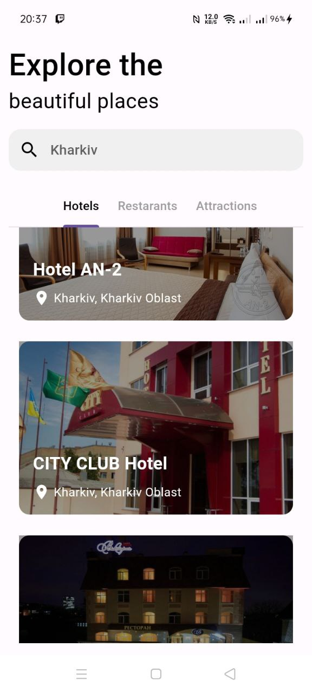
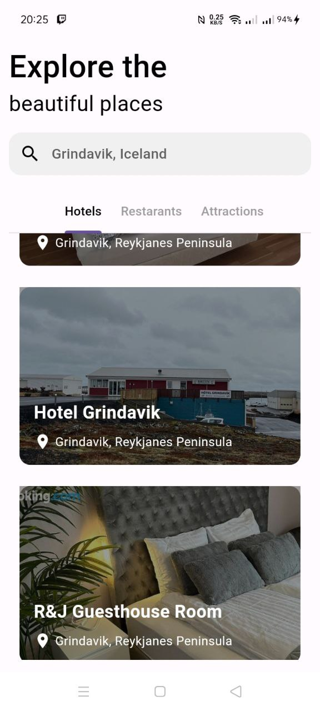
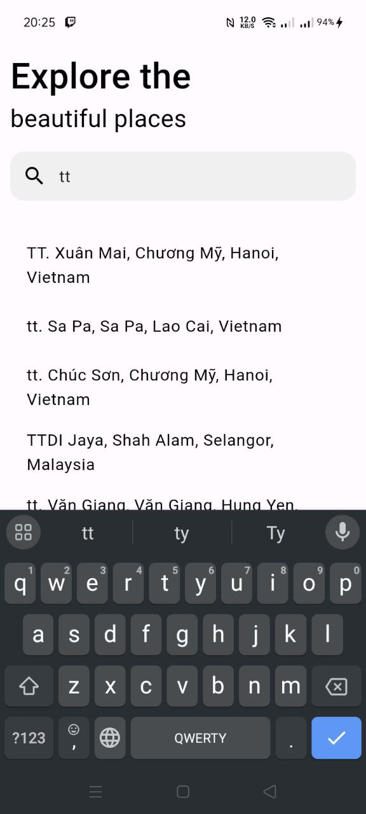
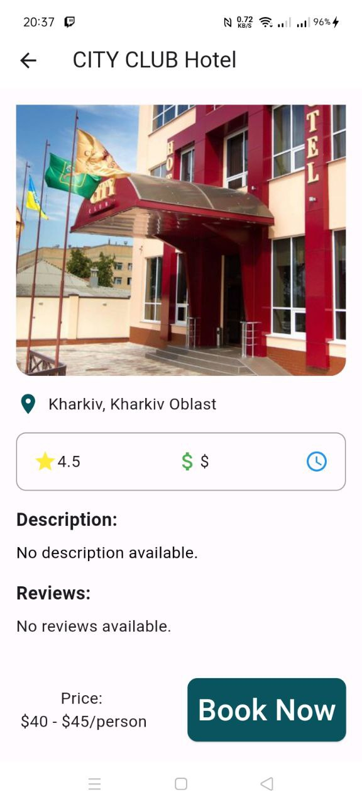

## Опис проекту: 
"Радник з подорожей" — це мобільний додаток, створений для полегшення подорожей та відкриття нових місць. Додаток допомагає користувачам знаходити та вивчати цікаві локації, забезпечуючи зручний інтерфейс для пошуку та відображення різних місць. Завдяки використанню сучасних технологій та інтерфейсу, користувачі можуть з легкістю планувати та насолоджуватися своїми подорожами.

## Використані технології:
- TripAdvisor: надає API, яке може бути використано для отримання відгуків, оцінок та інформації про готелі та ресторани.
- Google Places API: Google Places API дозволяє користувачам шукати місця, отримувати деталі та іншу інформацію про різні локації.
- Animate_do: Пакет "animate_do" використовується для реалізації плавних та привабливих анімацій у додатку.
- Get: Пакет "get" використовується для управління станом додатку та створення ефективного коду.
- Flutter: є основним фреймворком для розробки мобільного додатку. Використовується для створення крос-платформених додатків з єдиною кодовою базою

Скріншоти (та опис до них):

1)
   Перше, що баче новий користувач.

   

3) Сторінка для пошуку місця та показу даних про готелі, ресторани та визначні місця.

   
   
   

3)  Сторінка для більш детального опису про вибраний об'єкт.
   
 
